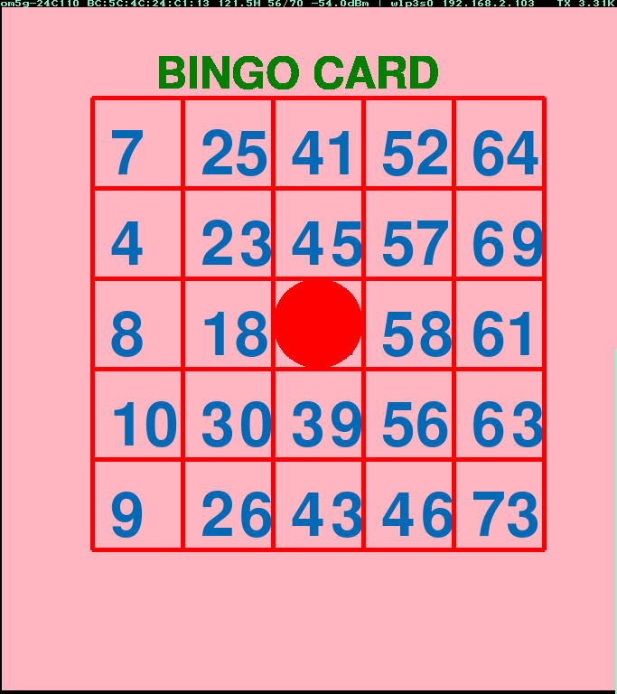

========================
Project description
========================
The programs in this repository are for playing bingo games.

There are two types of programs in this repository, bingo.py is a
program that displays random numbers when doing numbers in Bingo.

Also, bingo-card.py is a program that creates a card for playing
bingo. By installing these two, multiple people can play bingo.

==================================================================

-----------------------------------------------
Image of using bingo.py and bingo-card.py
-----------------------------------------------

