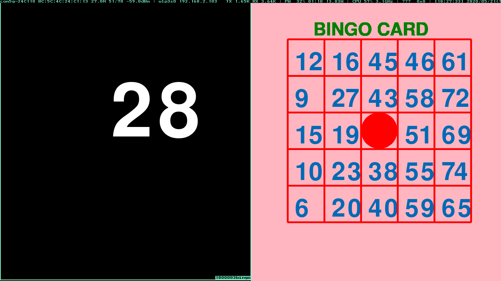
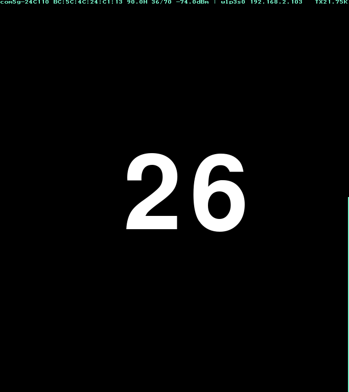
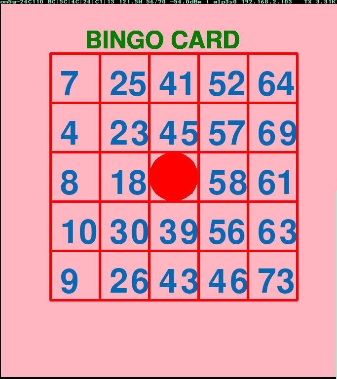

========================
Project description
========================
The programs in this repository are for playing bingo games.

There are two types of programs in this repository, bingo.py is a
program that displays random numbers when doing numbers in Bingo.

Also, bingo-card.py is a program that creates a card for playing
bingo. By installing these two, multiple people can play bingo.

https://qiita.com/taiseiyo11/items/f8096c5ff59fd20b523a
Additional explanation is provided at this URL.

==================================================================

-----------------------------------------------
Image of using bingo.py and bingo-card.py
-----------------------------------------------
*Image* when **both programs are started at the same time**

	   
===========  ================
  bingo.py    bingo-card.py
-----------  ----------------
  |bingo|      |bingo-card|
===========  ================

-------------------------------------------------
